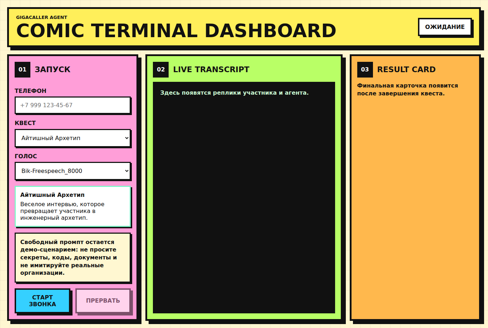

# GigaCaller Agent

Веб-демо для конференции: оператор вводит телефон участника, выбирает голосовой квест, а участник разговаривает с LLM по обычному телефонному звонку через `gigacaller-gateway`.

UI показывает live transcript, технические события и итоговую карточку разговора. Карточка генерируется через GigaChat, а если GigaChat не настроен или недоступен, используется локальная fallback-карточка.



## Что внутри

- React UI и Node.js backend в одном процессе.
- REST API для запуска и остановки звонка.
- SSE для live transcript и статусов.
- WebSocket-клиент для `gigacaller-gateway`.
- Cookie-aware WebSocket handshake для gateway-стендов за nginx.
- GigaChat post-call генерация итоговой карточки.
- Свободный промпт отправляется в `systemPrompt` как есть, без backend-добавок.
- Binary audio chunks не выводятся в UI.

## Квесты

- `Айтишный Архетип` - шуточное интервью, которое превращает участника в инженерный архетип.
- `Исповедь Отладчика` - история бага превращается в мини-postmortem.
- `Мини-RPG: Прод Упал` - голосовой incident-квест.
- `Свободный промпт` - полностью ваш системный промпт для звонка.

## Требования

- Node.js 20+
- npm
- доступный `gigacaller-gateway`
- GigaChat Authorization Key, если нужна LLM-карточка вместо fallback

## Быстрый старт

```bash
git clone git@github.com:dianagerdt/caller-agent.git
cd caller-agent
npm install
cp .env.example .env
npm run dev
```

Откройте:

```text
http://localhost:3000
```

## Настройка `.env`

Минимальная настройка для звонков:

```env
PORT=3000
GIGACALLER_GATEWAY_WS_URL=wss://your-gateway.example.test
GIGACALLER_GATEWAY_USERNAME=your_gateway_login
GIGACALLER_GATEWAY_PASSWORD=your_gateway_password
GIGACALLER_GATEWAY_TLS_REJECT_UNAUTHORIZED=true
DEFAULT_RETRY=0
DEFAULT_VOICE=Bik-Freespeech_8000
```

Для workshop-стенда gateway использует Basic Auth и cookie на redirect'ах.

Если локальный стенд использует недоверенный сертификат, временно поставьте:

```env
GIGACALLER_GATEWAY_TLS_REJECT_UNAUTHORIZED=false
```

## GigaChat

GigaChat нужен только для красивой итоговой карточки. Без него звонок и fallback-карточка работают.

1. Откройте https://developers.sber.ru/studio.
2. Создайте или откройте проект GigaChat API.
3. Получите Authorization Key в настройках API.
4. Заполните `.env`:

```env
GIGACHAT_API_KEY=your_authorization_key
GIGACHAT_SCOPE=GIGACHAT_API_PERS
GIGACHAT_AUTH_URL=https://ngw.devices.sberbank.ru:9443/api/v2/oauth
GIGACHAT_API_BASE_URL=https://gigachat.devices.sberbank.ru/api/v1
GIGACHAT_MODEL=GigaChat
GIGACHAT_TLS_REJECT_UNAUTHORIZED=true
```

Как это работает:

1. backend отправляет `POST /api/v2/oauth` на `GIGACHAT_AUTH_URL` с `Authorization: Basic <GIGACHAT_API_KEY>`;
2. получает `access_token`;
3. отправляет `POST /chat/completions` на `GIGACHAT_API_BASE_URL` с `Authorization: Bearer <access_token>`;
4. превращает JSON-ответ модели в result card.

Официальная инструкция GigaChat: https://developers.sber.ru/docs/ru/gigachat/quickstart/ind-using-api

## Как провести демо

1. Запустите `npm run dev`.
2. Откройте `http://localhost:3000`.
3. Введите номер участника в формате `+7XXXXXXXXXX` или `8XXXXXXXXXX`.
4. Выберите квест и freespeech-голос.
5. Нажмите `Старт звонка`.
6. Следите за live transcript.
7. После завершения звонка посмотрите карточку справа.

## Доступные голоса

- `Bik-Freespeech_8000`
- `Che-Freespeech_8000`
- `Erm-Freespeech_8000`
- `She-Freespeech_8000`
- `Ved-Freespeech_8000`

## Команды

```bash
npm run dev      # backend + UI
npm test         # тесты
npm run build    # production build
npm start        # запуск production build
```

## Troubleshooting

### `Unsupported engine`

Нужен Node.js 20+.

```bash
node -v
```

### `unable to get local issuer certificate`

Для локального стенда можно временно отключить проверку сертификата:

```env
GIGACALLER_GATEWAY_TLS_REJECT_UNAUTHORIZED=false
GIGACHAT_TLS_REJECT_UNAUTHORIZED=false
```

### `Invalid phone number`

Используйте российский номер:

```text
+7XXXXXXXXXX
8XXXXXXXXXX
```

### Карточка показывает `fallback`

Проверьте:

- `GIGACHAT_API_KEY` заполнен Authorization Key из Studio;
- `GIGACHAT_MODEL=GigaChat` или другая доступная модель;
- при ошибке сертификата поставьте `GIGACHAT_TLS_REJECT_UNAUTHORIZED=false` для локального демо.

## Безопасность

- Не коммитьте `.env`.
- Не вводите номера без согласия участника.
- Не просите у участника пароли, коды, документы или банковские данные.
- TLS bypass используйте только для локального демо.
